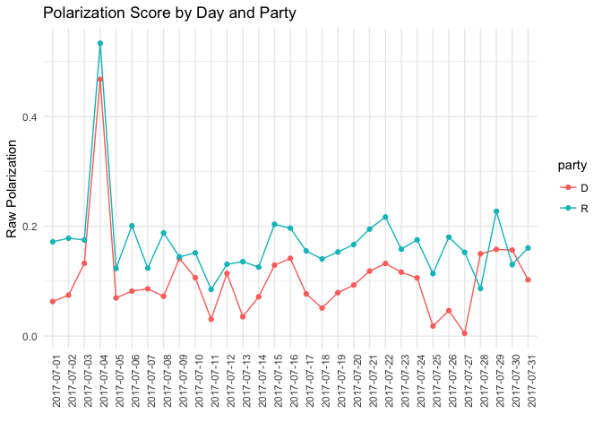
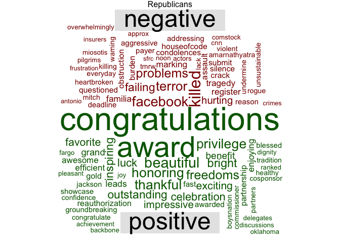
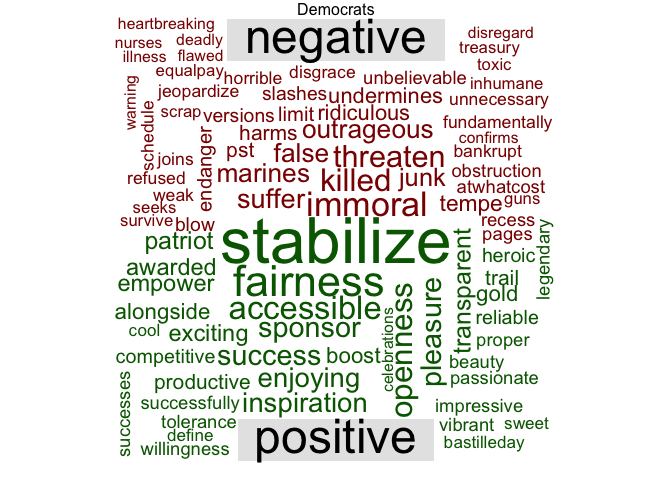

Tracking Congress Political Polarization with Tweeter
================
August 07, 2017

American Politics has become polarized over the past quarter-century. Research shows that American politics are more segregated and legislators have less common voting than decades ago, when senators regularly crossed the aisle to get things done. This phenomenon does not only affect politicians but also the public. According to data from the Pew Research Center, 45% of Republicans and 41% of Democrats think the other party is so dangerous that they consider it as a **threat to the nation**. Some commentators have also suggested that *media* and *new social platforms* exacerbate political polarization by spreading *fake news*.

A polarized political environment has negative consequences, especially when the control of the executive and legislative branches are split among cohesive parties. Some of its drawbacks include the reduction of the number of compromises parties are willing to take, **less legislative productivity**, gridlocks, less policy innovation, and inhibition of the majority rule. All these consequences affects people, so it is important to look for alternative measures that help us to track political polarization.

Using only legislative votes is rather limited because they only reflects the consolidation of polarization behavior and cannot be tracks in day by day. In this project, I propose to create an index of polarization and political mood analyzing Congress members' tweets. The goal is to provide an alternative and fine-grained measure - that supplements traditional ones - to track Congress polarization and explore their consequences on legislation practices and outcomes.

The goals of this project are:

1.  To track the level of positivity and negativity of daily Congress members tweets using **sentiment analysis**.
2.  To create an index of polarization from Congress tweets. After adjusting subjectivity lexicons and assess text classification, to define a method to classify tweets every day and create a polarization index.
3.  To explore the association between positivity and polarization indexes with outcomes such as Congress approval ratings and proportion of bill passed.

Data
====

I use data collected by the developer Alex Litel through the app ([Congressional Tweet Automator](https://github.com/alexlitel/congresstweets)). This app stores Congress member’s tweets every day, and it was highlighted recently in a [Washington Post article](https://www.washingtonpost.com/news/politics/wp/2017/06/26/how-congress-tweets-visualized/?utm_term=.6e80a8653a5f).

Daily tweet meta information on Congress members is stored in JSON files.

Getting metadata (party affiliation)
------------------------------------

For now, I am using user's `screen names` to merge meta and tweeter data. This is not ideal because user's `screen names` are subject to change. Alex Litel is willing to add user's `id_str` and archiving old users in the metadata file (see more [here](https://github.com/alexlitel/congresstweets/issues/2)).

``` r
#+ get metadata (party affiliation)
url <- "https://raw.githubusercontent.com/alexlitel/congresstweets-automator/master/data/users-filtered.json"

meta <- jsonlite::fromJSON(url, simplifyDataFrame = FALSE)
length(meta)
```

    ## [1] 592

``` r
# extract data of interest (nested lists)
dmeta <- list()
for (i in 1:length(meta)) {
  temp <- meta[[i]]
  temp
  dmeta[[i]] <- data.table(
  name =temp$name,
  chamber =temp$chamber,
  type = temp$type,
  party = ifelse(is.null(temp$party), NA, temp$party),
  sn1 = ifelse(length(temp$accounts$office) > 0 &&
                 !is.null(temp$accounts$office[[1]]$screen_name),
               temp$accounts$office[[1]]$screen_name, NA), # first screen name
  sn2 = ifelse(length(temp$accounts$campaing) > 0 &&
                 !is.null(temp$accounts$campaign[[1]]$screen_name),
               emp$accounts$campaign[[1]]$screen_name, NA)) # second screen name
}

dmeta <- rbindlist(dmeta)
table(is.na(dmeta$sn1)) # missing screen names
```

    ##
    ## FALSE  TRUE
    ##   583     9

``` r
summary(dmeta)
```

    ##      name             chamber              type
    ##  Length:592         Length:592         Length:592
    ##  Class :character   Class :character   Class :character
    ##  Mode  :character   Mode  :character   Mode  :character
    ##     party               sn1              sn2
    ##  Length:592         Length:592         Mode:logical
    ##  Class :character   Class :character   NA's:592
    ##  Mode  :character   Mode  :character

``` r
prop.table(table(dmeta$chamber))
```

    ##
    ##       house       joint      senate
    ## 0.798986486 0.003378378 0.197635135

``` r
prop.table(table(dmeta$type))
```

    ##
    ##      caucus   committee      member       party
    ## 0.023648649 0.060810811 0.908783784 0.006756757

``` r
anyDuplicated(dmeta[type == "member", name]) # duplicates among members
```

    ## [1] 0

``` r
dmeta <- dmeta[type == "member"] # select only members
table(dmeta$chamber, useNA = "ifany")
```

    ##
    ##  house senate
    ##    438    100

``` r
anyDuplicated(dmeta$sn1)
```

    ## [1] 126

``` r
anyDuplicated(dmeta$sn2)
```

    ## [1] 2

``` r
setkey(dmeta, sn1)
dmeta[, screen_name := ifelse(is.na(sn1), sn2, sn1)] # to use second screen nanme only if the first one is missing
dmeta[!is.na(screen_name), N := .N, screen_name]
table(dmeta$N, useNA = "ifany") # no duplicates except for missing cases
```

    ##
    ##    1 <NA>
    ##  529    9

``` r
# congress member names from metadata
mnames <- unique(dmeta$screen_name)
```

Getting tweeter data
--------------------

``` r
#+ load tweeter data by month
dates <- seq(as.Date("2017-07-01"), as.Date("2017-07-31"), by = "day")

ldat <- list()
for (i in seq_along(dates)) {
      url <- paste0("https://alexlitel.github.io/congresstweets/data/", dates[i], ".json")
      ldat[[i]] <- jsonlite::fromJSON(url, simplifyDataFrame = TRUE)
}

length(ldat)
```

    ## [1] 31

``` r
dat <- rbindlist(ldat)
nrow(dat)
```

    ## [1] 55138

``` r
tnames <- unique(dat$screen_name)
notthere <- !tnames %in% mnames
length(notthere)
```

    ## [1] 856

``` r
there <- tnames[!notthere]
length(there) # not that bad, I will use this for now
```

    ## [1] 505

Combining data files
--------------------

``` r
# merge data
setkey(dat, screen_name)
setkey(dmeta, screen_name)

dat <- dmeta[dat]
dat <- dat[!is.na(name)] # for now remove unmatched cases
nrow(dat)
```

    ## [1] 37578

Some descriptives
-----------------

I am considering only Congress member tweets from July, 2017. As can be seen, Democrats are more active in Tweeter. The number of tweets follows a clear cycle by day: Peaks during weekdays, and much less frequency during weekends.

``` r
ts <- dat[, .(N = .N), .(screen_name, party)][party != "I"]
table(ts$party, useNA = "ifany")
```

    ##
    ##   D   R
    ## 225 278

``` r
ts[, .(mean = mean(N)), party]
```

    ##    party      mean
    ## 1:     R  51.09712
    ## 2:     D 103.20889

``` r
ggplot(ts, aes(N, fill = party)) +
 geom_histogram(bins = 50) +
 labs(title = "Number of tweets per member", x = "Tweets", y = "Count")  +
 theme_minimal()
```


``` r
# tweets by day
dat[, day := day(time)]
dat[, month := month(time)]
dat[, year := year(time)]
dat[, ymd := ymd(paste(year, month, day, sep = "-"))]
dat[, ymd := factor(ymd, order = TRUE)]

ts <- dat[party != "I", .(N = .N), .(ymd, party)]

ggplot(ts, aes(y = N, x = ymd, group = party, colour = party)) +
 geom_line() + geom_point() +
 labs(title = "Number of tweets per day", x = "Tweets", y = "Count") +
  theme_minimal() +
  theme(axis.text.x = element_text(angle = 90, hjust = 1))
```


Preliminary analysis
====================

The objective preliminary analysis is to estimate the polarity of tweets, that is, the measure of positive or negative intent in a writer's tone. The aim is to examine their variability and describe the most frequent words used by polarity and political party. This is just a first step in defining a more complex polarization index.

After collecting tweets, I kept only those coming from accounts that match metadata. Then, I cleaned tweets by removing retweets (RT), URLs and usernames. Future versions of this analysis will process (punctuation based) emoticons and emojis.

``` r
wdat <- copy(dat)
wdat[, otext := text] # save original text

wdat[1, .(text, otext)]

# some cleaning
wdat[, rts := ifelse(grepl("(^RT\\s)", text), 1, 0)]
table(wdat$rts, useNA = "ifany")
wdat <- wdat[rts == 0]

wdat[, text := gsub("QT.+", "", text)] # remove quotes
wdat[, text := gsub("&amp;", "and", text)]
wdat[, text := gsub("@\\w+", "", text)] # usernames
wdat[, text := gsub("((f|ht)tp\\S+\\s*|www\\S+\\s*)", "", text)] # URLS
wdat[, text := gsub("(\n|//)", " ", text, perl = TRUE)] # scapes
wdat[, text := gsub("^\\s+|\\s+$", "", text)] # spaces
#wdat[, text := removeNumbers("text")] # numbers
wdat[, text := gsub("^ *|(?<= ) | *$", "", text, perl = TRUE)]
wdat[, text := iconv(text, "latin1", "ASCII", sub="")]
wdat[, text := tolower(text)]


# wdat[, text := iconv(text, "latin1", "UTF-8",sub='')]

wdat <- wdat[text != ""]
nrow(wdat)

rows <- sample(1:nrow(wdat), 10)
wdat[rows, text, otext][1]


#+ identify language
#wdat[, lang := textcat(text, p = ECIMCI_profiles)]
#table(wdat$lang, useNA = "ifany")
#wdat[lang == "fr", .(rts, text)]

# select only english tweets for now!
#wdat <- wdat[lang == "en"] # the textcat function is not always precise
nrow(wdat)
```

I used the polarity function from package `qdap` to scan for positive and negative words within a list of terms associated with a particular emotional (i.e., subjectivity lexicon) and obtain *polarity scores*. Negative numbers represent a negative tone, zero represents a neutral tone, and positive numbers a positive tone. I used the lexicon developed by Bing Liu at the University of Illinois at Chicago.

I analyzed 25857 tweets from Democrats and Republican members. Most of the tweets come from Democrats (0.62), and the House of Representatives (0.7). Below I show the distribution of the polarity scores.

``` r
pol <- polarity(wdat$text)
wdat[, polarity := pol$all$polarity]
wdat[, zpolarity := scale(pol$all$polarity)]

summary(wdat$polarity)
```

    ##    Min. 1st Qu.  Median    Mean 3rd Qu.    Max.
    ## -1.7321  0.0000  0.0000  0.1115  0.2774  2.2942

``` r
summary(wdat$zpolarity)
```

    ##    Min. 1st Qu.  Median    Mean 3rd Qu.    Max.
    ## -5.5128 -0.3334 -0.3334  0.0000  0.4960  6.5269

``` r
#wdat[is.na(polarity), .(name, text)]

ggplot(wdat[party != "I"], aes(x = polarity, group = party, fill = party)) +
  geom_histogram(aes(y=..count../sum(..count..)), position = "identity",  binwidth = 0.25, alpha = 0.5, bins = 50) +
  labs(y = "Proportion", x = "Raw Polarity", title = "Histogram Raw Polarity Score by Party") +
  theme_minimal()
```


``` r
wdat[party != "I", .(avg_polarity = Mean(polarity)), party]
```

    ##    party avg_polarity
    ## 1:     R   0.15906885
    ## 2:     D   0.08277276

``` r
wdat[party != "I", .(avg_zpolarity = Mean(zpolarity)), party]
```

    ##    party avg_zpolarity
    ## 1:     R    0.14226873
    ## 2:     D   -0.08588284

The average of the polarity score is 0.11. This means that on average each tweet is rather neutral, although they slightly incline towards more positive words. Democrats seem to have a higher proportion of *neutral* and negative words, what is confirmed by comparing the average polarity by party: 0.08 for Democrats, and 0.16 for Republicans.

The figure below shows the average polarity score by political party and day.

``` r
# polarity by day
agg <- wdat[party != "I", .(polarity = Mean(polarity), zpolarity = Mean(zpolarity)), .(party, ymd)]

setkey(agg, party, ymd)
d <- agg[, .(d = abs(diff(polarity))), ymd]
setorder(d, -d)
d[1:3]
```

    ##           ymd         d
    ## 1: 2017-07-27 0.1480409
    ## 2: 2017-07-26 0.1342197
    ## 3: 2017-07-06 0.1181323

``` r
ggplot(agg, aes(x = ymd, y = polarity, group = party, colour = party, fill = party)) +
  geom_line() +
  geom_point()  +
  labs(x = "", y = "Raw Polarization", title = "Polarization Score by Day and Party") +
  theme_minimal() +
  theme(axis.text.x = element_text(angle = 90, hjust = 1))
```



As can be seen, polarity scores vary considerably over time. Positivity reaches a pick during the Independence Day when both parties tend to coincide on their positive tone. The biggest difference between scores is observed on July 27th and 26th, when there was tension on Congress due to the Health Care bill. This provides some initial face validity of the polarity score.

Finally, I show word clouds by party based on a scaled polarity score. In the case of Republicans, most of the positive words are related to the independence day (*congratulations*, *award*, *beatiful*), while among Democrats there are more messages related to *stabilize*, *fairness*, *accessible*. Regarding the negative words, both parties highlight the tragedy of US marines in Mississippi, although Democrats emphasize terms such as *immoral*, *threaten*, *illness*, *suffer*. Performing topic modeling and clustering will provide more insights on these patterns.

``` r
createWordCloud <- function(data, title = "World Cloud") {
  neg.tweets <- data[zpolarity > 0, text]
  pos.tweets <- data[zpolarity < 0, text]
  pos.terms <- paste(pos.tweets, collapse = " ")
  neg.terms <- paste(neg.tweets, collapse = " ")
  all.terms <- c(pos.terms, neg.terms)
  all.corpus <- VCorpus(VectorSource(all.terms))
  all.tdm <- TermDocumentMatrix(all.corpus,
                                control = list(weighting = weightTfIdf,
                                               removePunctuation = TRUE,
                                               stopwords = stopwords(kind = "en")))
  all.tdm.m <- as.matrix(all.tdm)
  colnames(all.tdm.m) <- c("negative", "positive")
  comparison.cloud(all.tdm.m, max.words = 100, colors = c("darkred", "darkgreen"))
  text(x=0.5, y=1.02, title)
}


createWordCloud(wdat[party == "R"], "Republicans")
```



``` r
createWordCloud(wdat[party == "D"], "Democrats")
```



Next steps
==========

This is my first time doing text analysis, and I am very excited about this project. Learning and applying data science techniques to get insights is exactly what I look for, that is why I applied to the Incubator. There is still a lot to do. I will follow these next steps:

1.  To use different subjectivity lexicons to assess the robustness of classifications, and adapt them accordingly to better capture the nature of tweets.
2.  To weight results by members rather than number of tweets.
3.  To use clustering and topic modeling methods to get insights on the content tweets by party, and characterize polarity scores in a more systematic way. [Some progress here!](topic_modeling.md)
4.  Create a Shiny app to process these data automatically and deliver it in a friendly format by day and month.

References
==========

-   Kwartler, T. (2017). Text mining in practice with R.
-   Munzert, S. (2015). Automated data collection with R: a practical guide to Web scraping and text mining. Chichester, West Sussex, United Kingdom: John Wiley & Sons Inc.
