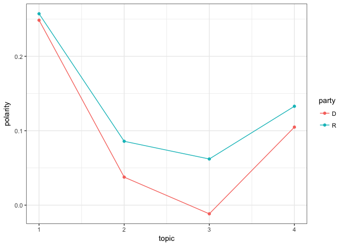
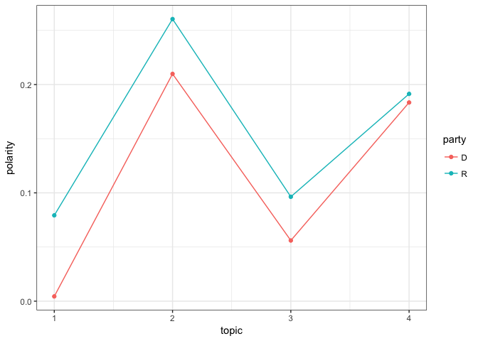

Topic Modeling Congress Members' Tweets
================
August 07, 2017

I explore Congress members' tweets using the Latent Dirichlet Allocation (LDA) method, a probability-based approach to find clusters in documents. The objective is to identify topics and compare [polarity scores](proposal.md) by party affiliation, that is, to find topics in which tone is different by party.

Using the processed data from the proposal, I run a LDA model with the `lda` package in R.

``` r
#+ load data and clean tweets
load("tweet_data.Rdata")
text <- wdat$text

char_to_remove <- c("m", "w", "t", "th", "c", "rd", "u", "s", "d", "en", "de", "la", "y", "el", "h")

text <- removeNumbers(text)
text <- removeWords(text, c(stopwords("en"), char_to_remove))
text <- removePunctuation(text)
text <- removeWords(text, c(stopwords("en"), char_to_remove))

blank.removal <- function(x) {
  x <- unlist(strsplit(x, " "))
  x <- subset(x, nchar(x) > 0)
  x <- paste(x, collapse = " ")
}

text <- pblapply(text, blank.removal)
tweets <- lexicalize(text)

wc <- word.counts(tweets$documents, tweets$vocab)
tweet.length <-  document.lengths(tweets$documents)
```

I ran several topic model after finding a solution with cluster/topics that seem reasonable for their content. I decided to identify 4 topics (`k = 4`). The LDA algorithm provide rather unstable results, so I have to look for better alternatives and specifications. The plot below shows that the model reaches convergence after 150 iterations.

``` r
k <- 4
num.iter <- 1000
alpha <- 0.02
eta <- 0.02

set.seed(123458)
fit <- lda.collapsed.gibbs.sampler(documents = tweets$documents, K = k,
  vocab = tweets$vocab,
  num.iterations = num.iter,
  alpha = alpha,
  eta = eta,
  initial = NULL,
  burnin = 50,
  compute.log.likelihood = TRUE)

plot(fit$log.likelihoods[1,], ylab = "Log likelihood")
```


``` r
top.topic.words(fit$topics, 20, by.score = TRUE)
```

    ##       [,1]             [,2]              [,3]            [,4]      
    ##  [1,] "care"           "happy"           "trump"         "great"   
    ##  [2,] "health"         "birthday"        "russia"        "town"    
    ##  [3,] "trumpcare"      "prayers"         "fy"            "hall"    
    ##  [4,] "medicaid"       "honor"           "netneutrality" "discuss" 
    ##  [5,] "aca"            "service"         "passed"        "pm"      
    ##  [6,] "gop"            "july"            "must"          "office"  
    ##  [7,] "repeal"         "family"          "sanctions"     "summer"  
    ##  [8,] "healthcare"     "wishing"         "ndaa"          "tune"    
    ##  [9,] "protectourcare" "independence"    "bill"          "meeting" 
    ## [10,] "coverage"       "transgender"     "security"      "students"
    ## [11,] "americans"      "john"            "house"         "enjoyed" 
    ## [12,] "bill"           "military"        "internet"      "tour"    
    ## [13,] "millions"       "thoughts"        "iran"          "visit"   
    ## [14,] "republicans"    "hero"            "bipartisan"    "interns" 
    ## [15,] "obamacare"      "independenceday" "act"           "county"  
    ## [16,] "insurance"      "celebrate"       "military"      "facebook"
    ## [17,] "senate"         "day"             "amendment"     "congrats"
    ## [18,] "costs"          "brave"           "putin"         "dc"      
    ## [19,] "plan"           "mccain"          "national"      "today"   
    ## [20,] "premiums"       "friend"          "defense"       "thanks"

``` r
top.topic.documents(fit$document_sums,1)
```

    ## [1] 14799 14073  1644  2375

The more frequent words by topic are shown below (both in a table and word cloud). The first topic is mainly about *health care reform and Affordable Care Act (ACA)* (7152 tweets). The second is on the *Independence Day* celebration (6813). The third topic focuses on the connection between Russia and Trump's administration (6033), and and the last one on *town hall*.

``` r
createWordCloud <- function(data, title = "Title", groups) {
  corp <- list()
  for (i in 1:groups) {
   corp[[i]] <- paste(data[topic == i, text], collapse = " ")
  }

  all.terms <- unlist(corp)
  all.corpus <- VCorpus(VectorSource(all.terms))
  all.tdm <- TermDocumentMatrix(all.corpus,
                                control = list(weighting = weightSMART,
                                               removePunctuation = TRUE,
                                               removeNumbers = TRUE,
                                                wordLengths=c(0,Inf),
                                               stopwords = stopwords(kind = "en")))
  all.tdm.m <- as.matrix(all.tdm)
  colnames(all.tdm.m) <- 1:groups
  comparison.cloud(all.tdm.m, random.order = FALSE, max.words = 100)
  text(x=0.5, y=1.02, title)
}

createWordCloud(wdat, "Word Cloud by Topics", 4)
```

    ## Warning in comparison.cloud(all.tdm.m, random.order = FALSE, max.words =
    ## 100): senate could not be fit on page. It will not be plotted.

    ## Warning in comparison.cloud(all.tdm.m, random.order = FALSE, max.words =
    ## 100): coverage could not be fit on page. It will not be plotted.

    ## Warning in comparison.cloud(all.tdm.m, random.order = FALSE, max.words =
    ## 100): republicans could not be fit on page. It will not be plotted.

    ## Warning in comparison.cloud(all.tdm.m, random.order = FALSE, max.words =
    ## 100): protectourcare could not be fit on page. It will not be plotted.

    ## Warning in comparison.cloud(all.tdm.m, random.order = FALSE, max.words =
    ## 100): insurance could not be fit on page. It will not be plotted.

    ## Warning in comparison.cloud(all.tdm.m, random.order = FALSE, max.words =
    ## 100): obamacare could not be fit on page. It will not be plotted.

    ## Warning in comparison.cloud(all.tdm.m, random.order = FALSE, max.words =
    ## 100): premiums could not be fit on page. It will not be plotted.

    ## Warning in comparison.cloud(all.tdm.m, random.order = FALSE, max.words =
    ## 100): improve could not be fit on page. It will not be plotted.

    ## Warning in comparison.cloud(all.tdm.m, random.order = FALSE, max.words =
    ## 100): republican could not be fit on page. It will not be plotted.

    ## Warning in comparison.cloud(all.tdm.m, random.order = FALSE, max.words =
    ## 100): away could not be fit on page. It will not be plotted.

    ## Warning in comparison.cloud(all.tdm.m, random.order = FALSE, max.words =
    ## 100): system could not be fit on page. It will not be plotted.

    ## Warning in comparison.cloud(all.tdm.m, random.order = FALSE, max.words =
    ## 100): affordable could not be fit on page. It will not be plotted.



Finally, we can see that differences in sentiment scores are higher in topics such *health care reform* and the *Russian meddling*, and tend to converge on positive topics such as the *Independence Day*. This provide some face validity to idea of using sentiment scores to create a polarization index.

``` r
theta <- t(pbapply(fit$document_sums + alpha, 2, function(x) x/sum(x)))
wdat[, topic := apply(theta,1,which.max)]
summary(wdat$topic)
```

    ##    Min. 1st Qu.  Median    Mean 3rd Qu.    Max. 
    ##   1.000   1.000   3.000   2.535   3.000   4.000

``` r
table(wdat$topic)
```

    ## 
    ##    1    2    3    4 
    ## 6925 4340 8424 6168

``` r
ts <- wdat[party != "I", .(polarity = Mean(polarity)), .(topic, party)]
d <- ts[, .(d = abs(diff(polarity))), .(topic)]
setorder(d, -d)
d
```

    ##    topic           d
    ## 1:     1 0.074835720
    ## 2:     2 0.050617178
    ## 3:     3 0.040361473
    ## 4:     4 0.007946237

``` r
ggplot(ts, aes(x = topic, y = polarity, group = party, fill = party, color = party)) + geom_point() + geom_line()
```



References
==========

-   Kwartler, T. (2017). Text mining in practice with R.
-   Munzert, S. (2015). Automated data collection with R: a practical guide to Web scraping and text mining. Chichester, West Sussex, United Kingdom: John Wiley & Sons Inc.
