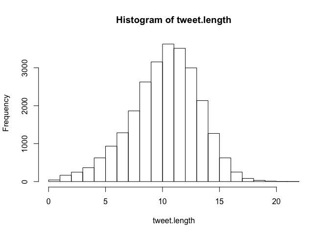

Topic Modeling Congress Members' Tweets
================
August 07, 2017

I explore tweets content by using the LDA method (Latent Dirichlet Allocation), a probability-based approach to find clustering within documents. The objective is to identify topics and compare [polarity scores](proposal.md) by party affiliation, that is, to identify topics in which tone is different by party.

Using the processed data from the proposal, I run a LDA model with the `lda` package in R.

``` r
#+ load data and clean tweets
load("tweet_data.Rdata")
text <- wdat$text

char_to_remove <- c("m", "w", "t", "th", "c", "rd", "u", "s", "d", "en", "de", "la", "y", "el")
text <- removeNumbers(text)
text <- removeWords(text, c(stopwords("en"), char_to_remove))
text <- removePunctuation(text)
text <- removeWords(text, c(stopwords("en"), char_to_remove))

blank.removal <- function(x) {
  x <- unlist(strsplit(x, " "))
  x <- subset(x, nchar(x) > 0)
  x <- paste(x, collapse = " ")
}

text <- pblapply(text, blank.removal)
tweets <- lexicalize(text)

wc <- word.counts(tweets$documents, tweets$vocab)
names(wc)
```

    ##    [1] "home"                  "free"                 
    ##    [3] "brave"                 "happy"                
    ##    [5] "july"                  "family"               
    ##    [7] "recently"              "sat"                  
    ##    [9] "talk"                  "recent"               
    ##   [11] "trip"                  "asia"                 
    ##   [13] "us"                    "china"                
    ##   [15] "relations"             "nk"                   
    ##   [17] "nuclear"               "threat"               
    ##   [19] "watch"                 "today"                
    ##   [21] "last"                  "day"                  
    ##   [23] "one"                   "interns"              
    ##   [25] "austin"                "griffin"              
    ##   [27] "sylvester"             "ll"                   
    ##   [29] "begin"                 "final"                
    ##   [31] "year"                  "fall"                 
    ##   [33] "thank"                 "col"                  
    ##   [35] "thomas"                "kunkel"               
    ##   [37] "service"               "moody"                
    ##   [39] "welcome"               "jennifer"             
    ##   [41] "short"                 "new"                  
    ##   [43] "base"                  "commander"            
    ##   [45] "wing"                  "just"                 
    ##   [47] "minutes"               "house"                
    ##   [49] "ag"                    "will"                 
    ##   [51] "kick"                  "hearing"              
    ##   [53] "innovation"            "technology"           
    ##   [55] "specialty"             "crops"                
    ##   [57] "urge"                  "colleagues"           
    ##   [59] "support"               "ndaa"                 
    ##   [61] "providing"             "military"             
    ##   [63] "including"             "southcom"             
    ##   [65] "mission"               "combating"            
    ##   [67] "criminal"              "orgs"                 
    ##   [69] "secdef"                "needs"                
    ##   [71] "reassess"              "current"              
    ##   [73] "capacity"              "need"                 
    ##   [75] "halt"                  "brac"                 
    ##   [77] "gives"                 "time"                 
    ##   [79] "fy"                    "best"                 
    ##   [81] "luck"                  "thomasville"          
    ##   [83] "native"                "jessica"              
    ##   [85] "welch"                 "competing"            
    ##   [87] "women"                 "open"                 
    ##   [89] "week"                  "interested"           
    ##   [91] "learning"              "passage"              
    ##   [93] "ndda"                  "run"                  
    ##   [95] "key"                   "provisions"           
    ##   [97] "impacting"             "ga"                   
    ##   [99] "friday"                "two"                  
    ##  [101] "katie"                 "zebulon"              
    ##  [103] "stephen"               "sandy"                
    ##  [105] "springs"               "wish"                 
    ##  [107] "tracy"                 "ingram"               
    ##  [109] "tifton"                "stopped"              
    ##  [111] "dc"                    "office"               
    ##  [113] "yesterday"             "town"                 
    ##  [115] "lcteachinst"           "ensuring"             
    ##  [117] "community"             "pharmacies"           
    ##  [119] "able"                  "remain"               
    ##  [121] "competitive"           "means"                
    ##  [123] "stronger"              "healthier"            
    ##  [125] "communities"           "happening"            
    ##  [127] "now"                   "committee"            
    ##  [129] "state"                 "infrastructure"       
    ##  [131] "rural"                 "america"              
    ##  [133] "can"                   "tbt"                  
    ##  [135] "vietnam"               "months"               
    ##  [137] "ago"                   "prayers"              
    ##  [139] "keep"                  "fighting"             
    ##  [141] "wednesday"             "continued"            
    ##  [143] "push"                  "provide"              
    ##  [145] "reliable"              "access"               
    ##  [147] "broadband"             "group"                
    ##  [149] "started"               "call"                 
    ##  [151] "visit"                 "please"               
    ##  [153] "sure"                  "important"            
    ##  [155] "work"                  "lot"                  
    ##  [157] "misconceptions"        "farming"              
    ##  [159] "good"                  "read"                 
    ##  [161] "clearing"              "couple"               
    ##  [163] "held"                  "renegotiating"        
    ##  [165] "nafta"                 "opportunities"        
    ##  [167] "improving"             "trade"                
    ##  [169] "remarks"               "thanks"               
    ##  [171] "stopping"              "nation"               
    ##  [173] "ranchers"              "farmers"              
    ##  [175] "laugh"                 "taking"               
    ##  [177] "photos"                "votes"                
    ##  [179] "snuck"                 "back"                 
    ##  [181] "pictures"              "proud"                
    ##  [183] "stand"                 "fulfilling"           
    ##  [185] "promise"               "tackle"               
    ##  [187] "security"              "concerns"             
    ##  [189] "along"                 "southern"             
    ##  [191] "border"                "haste"                
    ##  [193] "makes"                 "waste"                
    ##  [195] "especially"            "dealing"              
    ##  [197] "healthcare"            "americans"            
    ##  [199] "thoughts"              "families"             
    ##  [201] "members"               "died"                 
    ##  [203] "plane"                 "crash"                
    ##  [205] "mississippi"           "trials"               
    ##  [207] "face"                  "health"               
    ##  [209] "care"                  "worsen"               
    ##  [211] "senate"                "republicans"          
    ##  [213] "pass"                  "trumpcare"            
    ##  [215] "bill"                  "reports"              
    ##  [217] "leave"                 "mississippians"       
    ##  [219] "uninsured"             "miss"                 
    ##  [221] "h"                     "delegation"           
    ##  [223] "young"                 "people"               
    ##  [225] "future"                "leaders"              
    ##  [227] "agriculture"           "chief"                
    ##  [229] "staff"                 "lanier"               
    ##  [231] "avant"                 "former"               
    ##  [233] "ms"                    "member"               
    ##  [235] "met"                   "visiting"             
    ##  [237] "youth"                 "jackson"              
    ##  [239] "meadowbrook"           "church"               
    ##  [241] "christ"                "visited"              
    ##  [243] "always"                "elated"               
    ##  [245] "speak"                 "thousands"            
    ##  [247] "suffer"                "passes"               
    ##  [249] "must"                  "act"                  
    ##  [251] "prevent"               "catastrophe"          
    ##  [253] "protectourcare"        "effort"               
    ##  [255] "protectourdemocracy"   "goes"                 
    ##  [257] "beyond"                "politics"             
    ##  [259] "partisanship"          "right"                
    ##  [261] "inflate"               "cost"                 
    ##  [263] "cut"                   "coverage"             
    ##  [265] "steal"                 "medicaid"             
    ##  [267] "gut"                   "protections"          
    ##  [269] "make"                  "friends"              
    ##  [271] "following"             "congressman"          
    ##  [273] "thompson"              "social"               
    ##  [275] "media"                 "channels"             
    ##  [277] "everything"            "thread"               
    ##  [279] "reps"                  "cummings"             
    ##  [281] "conyers"               "brady"                
    ##  [283] "sent"                  "letter"               
    ##  [285] "demanding"             "removal"              
    ##  [287] "kris"                  "kobach"               
    ##  [289] "copy"                  "icymi"                
    ##  [291] "appeared"              "news"                 
    ##  [293] "congressional"         "task"                 
    ##  [295] "force"                 "national"             
    ##  [297] "executives"            "professionals"        
    ##  [299] "assoc"                 "awarded"              
    ##  [301] "distinguished"         "leadership"           
    ##  [303] "award"                 "nsepa"                
    ##  [305] "give"                  "american"             
    ##  [307] "better"                "starts"               
    ##  [309] "giving"                "abetterdeal"          
    ##  [311] "\n"                    "lowering"             
    ##  [313] "price"                 "prescription"         
    ##  [315] "drugs\n"               "making"               
    ##  [317] "college"               "affordable\n"         
    ##  [319] "cracking"              "outsourcing"          
    ##  [321] "jobs"                  "birthday"             
    ##  [323] "let"                   "remember"             
    ##  [325] "life"                  "emmett"               
    ##  [327] "till"                  "tragedy"              
    ##  [329] "endured"               "legacy"               
    ##  [331] "lives"                 "instead"              
    ##  [333] "rx"                    "drug"                 
    ##  [335] "gouging"               "working"              
    ##  [337] "millions"              "participating"        
    ##  [339] "twitter"               "hall"                 
    ##  [341] "tomorrow"              "ask"                  
    ##  [343] "questions"             "affect"               
    ##  [345] "answering"             "pm"                   
    ##  [347] "tonight"               "tweet"                
    ##  [349] "using"                 "cbconhealthcare"      
    ##  [351] "ensure"                "see"                  
    ##  [353] "everyone"              "asked"                
    ##  [355] "fight"                 "stop"                 
    ##  [357] "continue"              "medicare"             
    ##  [359] "helped"                "seniors"              
    ##  [361] "children"              "disabled"             
    ##  [363] "years"                 "preserved"            
    ##  [365] "generations"           "want"                 
    ##  [367] "billion"               "hard"                 
    ##  [369] "earned"                "taxpayer"             
    ##  [371] "dollars"               "trump"                
    ##  [373] "ineffective"           "immoral"              
    ##  [375] "wall"                  "early"                
    ##  [377] "morning"               "aca"                  
    ##  [379] "repeal"                "failed"               
    ##  [381] "put"                   "aside"                
    ##  [383] "partisan"              "democrats"            
    ##  [385] "wishing"               "fun"                  
    ##  [387] "safe"                  "fourth"               
    ##  [389] "weekend"               "minnesota"            
    ##  [391] "remembers"             "project"              
    ##  [393] "collecting"            "minnesotans"          
    ##  [395] "stories"               "war"                  
    ##  [397] "submit"                "country"              
    ##  [399] "st"                    "great"                
    ##  [401] "reflect"               "values"               
    ##  [403] "truly"                 "data"                 
    ##  [405] "shows"                 "bad"                  
    ##  [407] "jeopardizes"           "million"              
    ##  [409] "costs"                 "billions"             
    ##  [411] "stay"                  "engaged"              
    ##  [413] "vocal"                 "transit"              
    ##  [415] "keeps"                 "united"               
    ##  [417] "strong"                "growing"              
    ##  [419] "leading"               "riverview"            
    ##  [421] "corridor"              "partners"             
    ##  [423] "vital"                 "risk"                 
    ##  [425] "kids"                  "get"                  
    ##  [427] "food"                  "summer"               
    ##  [429] "loved"                 "ones"                 
    ##  [431] "many"                  "touched"              
    ##  [433] "philandocastile"       "called"               
    ##  [435] "paul"                  "devoted"              
    ##  [437] "serving"               "students"             
    ##  [439] "public"                "schools"              
    ##  [441] "congress"              "comply"               
    ##  [443] "basic"                 "ethics"               
    ##  [445] "standards"             "covering"             
    ##  [447] "unethical"             "behavior"             
    ##  [449] "stood"                 "constitution"         
    ##  [451] "rules"                 "deserves"             
    ##  [453] "grateful"              "qt"                   
    ##  [455] "repeated"              "ethical"              
    ##  [457] "violations"            "led"                  
    ##  [459] "head"                  "nonpartisan"          
    ##  [461] "resign"                "commission"           
    ##  [463] "part"                  "gop"                  
    ##  [465] "voter"                 "suppression"          
    ##  [467] "agenda"                "political"            
    ##  [469] "strategy"              "harder"               
    ##  [471] "vote"                  "refusing"             
    ##  [473] "voters"                "personal"             
    ##  [475] "info"                  "sham"                 
    ##  [477] "election"              "games"                
    ##  [479] "improve"               "affordable"           
    ##  [481] "congratulations"       "woodbury"             
    ##  [483] "high"                  "school"               
    ##  [485] "senior"                "meghan"               
    ##  [487] "rice"                  "winning"              
    ##  [489] "gold"                  "receiving"            
    ##  [491] "tour"                  "federal"              
    ##  [493] "habitat"               "americorps"           
    ##  [495] "critical"              "full"                 
    ##  [497] "congrats"              "bayport"              
    ##  [499] "police"                "laura"                
    ##  [501] "eastman"               "mn"                   
    ##  [503] "city"                  "government"           
    ##  [505] "sharing"               "story"                
    ##  [507] "campaign"              "conduct"              
    ##  [509] "illegal"               "don"                  
    ##  [511] "know"                  "trumprussia"          
    ##  [513] "outrageous"            "fully"                
    ##  [515] "completely"            "investigate"          
    ##  [517] "scandal"               "took"                 
    ##  [519] "away"                  "internet"             
    ##  [521] "privacy"               "rights"               
    ##  [523] "netneutrality"         "protect"              
    ##  [525] "oppose"                "sharp"                
    ##  [527] "cuts"                  "epa"                  
    ##  [529] "programs"              "resources"            
    ##  [531] "fund"                  "priorities"           
    ##  [533] "interior"              "environment"          
    ##  [535] "weakens"               "enforcement"          
    ##  [537] "toxins"                "air"                  
    ##  [539] "water"                 "proposed"             
    ##  [541] "undermine"             "ability"              
    ##  [543] "human"                 "environmental"        
    ##  [545] "protection"            "agency"               
    ##  [547] "hit"                   "budget"               
    ##  [549] "unacceptable"          "disappointed"         
    ##  [551] "wants"                 "natural"              
    ##  [553] "cultural"              "affront"              
    ##  [555] "democracy"             "funds"                
    ##  [557] "spent"                 "exists"               
    ##  [559] "solely"                "justify"              
    ##  [561] "false"                 "claims"               
    ##  [563] "voting"                "introducing"          
    ##  [565] "amendment"             "defund"               
    ##  [567] "integrity"             "foot"                 
    ##  [569] "indulge"               "rants"                
    ##  [571] "conspiracy"            "theories"             
    ##  [573] "strongly"              "never"                
    ##  [575] "become"                "law"                  
    ##  [577] "propose"               "marking"              
    ##  [579] "appropriations"        "bills"                
    ##  [581] "commerce"              "justice"              
    ##  [583] "science"               "financial"            
    ##  [585] "services"              "general"              
    ##  [587] "learn"                 "bipartisan"           
    ##  [589] "meet"                  "safety"               
    ##  [591] "tribal"                "nations"              
    ##  [593] "helps"                 "fulfill"              
    ##  [595] "responsibility"        "passed"               
    ##  [597] "civil"                 "debate"               
    ##  [599] "offering"              "defunding"            
    ##  [601] "money"                 "vigilant"             
    ##  [603] "defend"                "even"                 
    ##  [605] "worse"                 "ultimate"             
    ##  [607] "goal"                  "policies"             
    ##  [609] "register"              "taxpayers"            
    ##  [611] "defeated"              "proposal"             
    ##  [613] "tax"                   "coalition"            
    ##  [615] "secretaries"           "states"               
    ##  [617] "elections"             "officers"             
    ##  [619] "rebuffed"              "fishing"              
    ##  [621] "expedition"            "opposite"             
    ##  [623] "invasive"              "request"              
    ##  [625] "sensitive"             "information"          
    ##  [627] "cornerstone"           "strengthening"        
    ##  [629] "easier"                "voted"                
    ##  [631] "repression"            "liu"                  
    ##  [633] "xiaobo"                "powerful"             
    ##  [635] "voice"                 "celebrate"            
    ##  [637] "rondo"                 "days"                 
    ##  [639] "owe"                   "marvin"               
    ##  [641] "anderson"              "across"               
    ##  [643] "district"              "talent"               
    ##  [645] "helping"               "lead"                 
    ##  [647] "top"                   "division"             
    ##  [649] "four"                  "branches"             
    ##  [651] "turning"               "still"                
    ##  [653] "eliminate"             "aisle"                
    ##  [655] "help"                  "assist"               
    ##  [657] "appointment"           "washington"           
    ##  [659] "busy"                  "ahead"                
    ##  [661] "markup"                "polar"                
    ##  [663] "icebreakers"           "ever"                 
    ##  [665] "redirect"              "pressing"             
    ##  [667] "interest"              "rich"                 
    ##  [669] "paid"                  "cutting"              
    ##  [671] "collapsing"            "weight"               
    ##  [673] "cruelty"               "statement"            
    ##  [675] "failure"               "together"             
    ##  [677] "ready"                 "serious"              
    ##  [679] "join"                  "table"                
    ##  [681] "opening"               "betterway"            
    ##  [683] "extraneous"            "clean"                
    ##  [685] "roll"                  "essential"            
    ##  [687] "endangered"            "species"              
    ##  [689] "dismayed"              "riders"               
    ##  [691] "benefit"               "polluters"            
    ##  [693] "nothing"               "pleased"              
    ##  [695] "rejected"              "reckless"             
    ##  [697] "backwards"             "enough"               
    ##  [699] "sighted"               "exactly"              
    ##  [701] "proposes"              "particularly"         
    ##  [703] "disturbing"            "healthy"              
    ##  [705] "deeply"                "proposing"            
    ##  [707] "dramatic"              "endanger"             
    ##  [709] "mark"                  "fiscal"               
    ##  [711] "smoggyskiesact"        "guts"                 
    ##  [713] "laws"                  "terrible"             
    ##  [715] "undo"                  "threatening"          
    ##  [717] "world"                 "grandchildren"        
    ##  [719] "re"                    "cmte"                 
    ##  [721] "remove"                "ideological"          
    ##  [723] "first"                 "worried"              
    ##  [725] "threaten"              "animals"              
    ##  [727] "already"               "reject"               
    ##  [729] "pave"                  "way"                  
    ##  [731] "oil"                   "drilling"             
    ##  [733] "treasure"              "anwr"                 
    ##  [735] "pristine"              "untouched"            
    ##  [737] "places"                "facts"                
    ##  [739] "climate"               "change"               
    ##  [741] "real"                  "question"             
    ##  [743] "going"                 "worst"                
    ##  [745] "effects"               "recognizes"           
    ##  [747] "reality"               "climatechange"        
    ##  [749] "encourages"            "efforts"              
    ##  [751] "address"               "well"                 
    ##  [753] "moves"                 "floor"                
    ##  [755] "look"                  "forward"              
    ##  [757] "csbg"                  "improves"             
    ##  [759] "supports"              "anti"                 
    ##  [761] "poverty"               "activities"           
    ##  [763] "action"                "agencies"             
    ##  [765] "ramsey"                "counties"             
    ##  [767] "block"                 "grant"                
    ##  [769] "gopbudget"             "ends"                 
    ##  [771] "pay"                   "betrays"              
    ##  [773] "\n\nshame"             "became"               
    ##  [775] "citizens"              "entire"               
    ##  [777] "newest"                "attacks"              
    ##  [779] "scientific"            "unprecedented"        
    ##  [781] "concerned"             "prestigious"          
    ##  [783] "circopedia"            "stillwater"           
    ##  [785] "library"               "comes"                
    ##  [787] "accessibility"         "raising"              
    ##  [789] "voices"                "hurting"              
    ##  [791] "tens"                  "advance"              
    ##  [793] "ripping"               "least"                
    ##  [795] "shameful"              "tilts"                
    ##  [797] "playing"               "field"                
    ##  [799] "towards"               "big"                  
    ##  [801] "banks"                 "credit"               
    ##  [803] "card"                  "companies"            
    ##  [805] "op"                    "ed"                   
    ##  [807] "explaining"            "misguided"            
    ##  [809] "giveaway"              "legislation"          
    ##  [811] "savethebwca"           "lands"                
    ##  [813] "chilean"               "conglomerate"         
    ##  [815] "bwca"                  "toxic"                
    ##  [817] "sulfide"               "ore"                  
    ##  [819] "copper"                "mining"               
    ##  [821] "moving"                "allows"               
    ##  [823] "dangerous"             "next"                 
    ##  [825] "boundary"              "waters"               
    ##  [827] "ve"                    "got"                  
    ##  [829] "nd"                    "anniversary"          
    ##  [831] "crucial"               "joining"              
    ##  [833] "outside"               "capitol"              
    ##  [835] "trumpcareprotest"      "every"                
    ##  [837] "quality"               "solutions"            
    ##  [839] "tolerate"              "gutter"               
    ##  [841] "kitchen"               "workplace"            
    ##  [843] "white"                 "honored"              
    ##  [845] "deliver"               "weekly"               
    ##  [847] "democratic"            "wrote"                
    ##  [849] "opposing"              "threatens"            
    ##  [851] "explain"               "getting"              
    ##  [853] "admin"                 "pulled"               
    ##  [855] "gateway"               "corp"                 
    ##  [857] "notice"                "mobility"             
    ##  [859] "eastern"               "seaboard"             
    ##  [861] "independence"          "global"               
    ##  [863] "usa"                   "\n\n"                 
    ##  [865] "happybirthdayamerica"  "urging"               
    ##  [867] "confront"              "putin"                
    ##  [869] "transgressions"        "around"               
    ##  [871] "silent"                "eyeball"              
    ##  [873] "rebuke"                "interference"         
    ##  [875] "hacking"               "russia"               
    ##  [877] "dispute"               "pre"                  
    ##  [879] "existing"              "condition"            
    ##  [881] "hits"                  "oh"                   
    ##  [883] "emails"                "engaging"             
    ##  [885] "listening"             "vibrant"              
    ##  [887] "korean"                "fort"                 
    ##  [889] "lee"                   "discussing"           
    ##  [891] "peninsula"             "korea"                
    ##  [893] "diplomacy"             "utmost"               
    ##  [895] "importance"            "threats"              
    ##  [897] "department"            "un"                   
    ##  [899] "northkorea"            "donaldtrumpjr"        
    ##  [901] "running"               "business"             
    ##  [903] "examine"               "trumptaxreturns"      
    ##  [905] "congressmustrequest"   "taxes"                
    ##  [907] "replace"               "works"                
    ##  [909] "lose"                  "pause"                
    ##  [911] "refocus"               "doesn"                
    ##  [913] "matter"                "version"              
    ##  [915] "trying"                "drive"                
    ##  [917] "ditch"                 "asleep"               
    ##  [919] "wheel"                 "take"                 
    ##  [921] "wakeupgop"             "requires"             
    ##  [923] "report"                "consideration"        
    ##  [925] "tbi"                   "ptsd"                 
    ##  [927] "separations"           "spoke"                
    ##  [929] "transportation"        "experts"              
    ##  [931] "finding"               "summerofhell"         
    ##  [933] "priority"              "tunnel"               
    ##  [935] "video"                 "fronts"               
    ##  [937] "foreign"               "domestic"             
    ##  [939] "congressmustrequest\n" "return"               
    ##  [941] "russian"               "compounds"            
    ##  [943] "\ncontinued"           "level"                
    ##  [945] "\ndaily"               "revelations"          
    ##  [947] "deception"             "\n\ntime"             
    ##  [949] "party"                 "rep"                  
    ##  [951] "franks"                "demonizes"            
    ##  [953] "islam"                 "abridges"             
    ##  [955] "exercise"              "religion"             
    ##  [957] "match"                 "words"                
    ##  [959] "renegotiation"         "middle"               
    ##  [961] "class"                 "view"                 
    ##  [963] "six"                   "workers"              
    ##  [965] "job"                   "promoting"            
    ##  [967] "worker"                "protecting"           
    ##  [969] "friendly"              "approach"             
    ##  [971] "old"                   "empty"                
    ##  [973] "rhetoric"              "madeinamerica"        
    ##  [975] "creating"              "incentives"           
    ##  [977] "things"                "nj"                   
    ##  [979] "homeowners"            "pummeled"             
    ##  [981] "eliminates"            "salt"                 
    ##  [983] "deduction"             "opposition"           
    ##  [985] "contemptible"          "acting"               
    ##  [987] "cavalierly"            "standup"              
    ##  [989] "baseball"              "shooting"             
    ##  [991] "glad"                  "wounded"              
    ##  [993] "recovery"              "opens"                
    ##  [995] "memorial"              "badly"                
    ##  [997] "injured"               "duty"                 
    ##  [999] "speaks"                "volumes"              
    ##  [ reached getOption("max.print") -- omitted 18975 entries ]

``` r
tweet.length <-  document.lengths(tweets$documents)
hist(tweet.length)
```



Here I run a topic model. After running the model several times, and based on the content of the topics, I decided to identify 7 topics (`k = 4`). This methods seems to be very unstable, I have to look for better alternatives and specifications.

``` r
k <- 4
num.iter <- 100
alpha <- 0.02
eta <- 0.02

set.seed(123458)
fit <- lda.collapsed.gibbs.sampler(documents = tweets$documents, K = k,
  vocab = tweets$vocab,
  num.iterations = num.iter,
  alpha = alpha,
  eta = eta,
  initial = NULL,
  burnin = 50,
  compute.log.likelihood = TRUE)

plot(fit$log.likelihoods[1,], ylab = "Log likelihood")
```


``` r
top.topic.words(fit$topics, 7, by.score = TRUE)
```

    ##      [,1]       [,2]        [,3]        [,4]           
    ## [1,] "happy"    "trump"     "health"    "netneutrality"
    ## [2,] "great"    "ndaa"      "care"      "internet"     
    ## [3,] "prayers"  "russia"    "trumpcare" "trump"        
    ## [4,] "birthday" "military"  "aca"       "russia"       
    ## [5,] "july"     "fy"        "repeal"    "must"         
    ## [6,] "family"   "passed"    "gop"       "care"         
    ## [7,] "wishing"  "sanctions" "medicaid"  "hall"

``` r
top.topic.documents(fit$document_sums,1)
```

    ## [1]  2375  1644  6654 17286

``` r
theta <- t(pbapply(fit$document_sums + alpha, 2, function(x) x/sum(x)))
wdat[, topic := apply(theta,1,which.max)]
summary(wdat$topic)
```

    ##    Min. 1st Qu.  Median    Mean 3rd Qu.    Max. 
    ##    1.00    1.00    2.00    2.41    3.00    4.00

``` r
table(wdat$topic)
```

    ## 
    ##    1    2    3    4 
    ## 7152 6813 6033 5859

``` r
ts <- wdat[party != "I", .(polarity = Mean(polarity)), .(topic, party)]
d <- ts[, .(d = abs(diff(polarity))), .(topic)]
setorder(d, -d)
d
```

    ##    topic           d
    ## 1:     3 0.073643986
    ## 2:     2 0.048140229
    ## 3:     4 0.027993260
    ## 4:     1 0.008705704

``` r
ggplot(ts, aes(x = topic, y = polarity, group = party, fill = party, color = party)) + geom_point() + geom_line()
```


References
==========

-   Kwartler, T. (2017). Text mining in practice with R.
-   Munzert, S. (2015). Automated data collection with R: a practical guide to Web scraping and text mining. Chichester, West Sussex, United Kingdom: John Wiley & Sons Inc.
