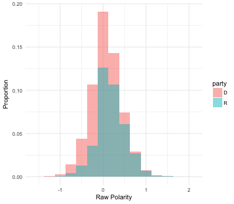
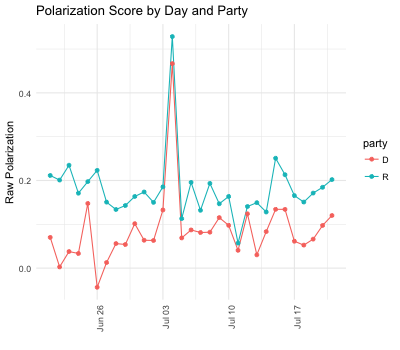
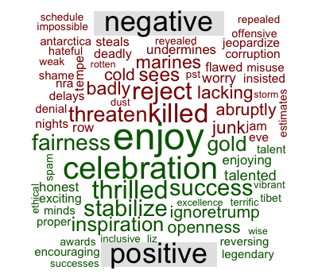
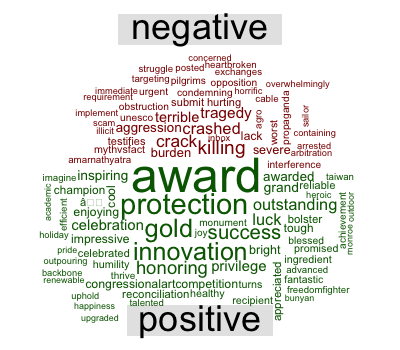

# Tracking Congress Tweets

American Politics has become polarized over the past quarter-century. Research has shown, using attraction-and-repulsion models adapted from physics and data on how senators vote, that American policy making has become more segregated and with little common voting, contrasting with what we observed decades ago where senators regularly crossed the aisle to get things done. This phenomenon is not only related to politicians but has also affected the public: according to data from the Pew Research Center, 45% of Republicans and 41% of Democrats think the other party is so dangerous that they consider it as a **threat to the nation**. Some commentators have also suggested that *media* and *new social platforms* exacerbate political polarization by spreading *fake news*.

A polarized political environment might have negative consequences, especially when the control of the executive and legislative branches are split among cohesive parties. Some of them include a reduction of the number of compromises that parties are willing to take, gridlock and **less legislative productivity**,  less policy innovation, and inhibition of majority rule. All these scenarios implied negative consequences for citizens and people directly or indirectly affected by the legislation.

In this project, I propose to create an index of polarization and political mood of Congress members by analyzing their tweets. The goal is to provide an alternative and fine-grained measure - that supplements traditional ones - to track congress polarization and explore their consequences on legislation practices and outcomes.

The goals of the project are:

1. To track the level of positivity and negativity of daily congress members tweets using **sentiment analysis** (i.e., extraction of *emotional intent* from text)
2. Create a index of polarization from congress tweets. After adjusting subjectivity lexicons and assess text classification, to define a method to classify tweets every day and create a polarization index.
4. To explore the association between positivity and polarization indexes with outcomes such as congress approval ratings and proportion of bill passed.

### Data

I use data collected by the developer Alex Litel, who created a tool ([Congressional Tweet Automator](https://github.com/alexlitel/congresstweets)) that stores every Congress member’s tweets every day, as been highlighted in a recent [Washington Post article](https://www.washingtonpost.com/news/politics/wp/2017/06/26/how-congress-tweets-visualized/?utm_term=.6e80a8653a5f).

Daily tweet files and meta information on congress members are in JSON format.

### Preliminary analysis

This  analysis uses congress tweets from June 21 to July 21, 2017. The objective is to estimate the polarity of tweets, that is, the measure of positive or negative intent in a writer's tone. The objective is to examine their variability and describe the most frequent words used by polarity and political party. This is just a first step in defining a more complex polarization index.

After collecting tweets, I kept only those coming from accounts that match metadata for all the accounts the project follows for tweet collection (e.g., party affiliation, name). Then, I cleaned tweets by removing retweets (RT), URLs, usernames. Future versions of this analysis will process (punctuation based) emoticons and emojis.

I used the polarity function from package `qdap` to scan for positive and negative word within a list of words associated with a particular emotional (i.e.,  subjectivity lexicon) and obtain polarity scores. Negative numbers represent a negative tone, zero represents a neutral tone, and positive numbers a positive tone. I used the lexicon developed by Bing Liu at the University of Illinois at Chicago.

I analyzed 32497 tweets, from Democrats and Republican members, 62% of them come from Democrats, and 72% from the House (28% from the Senate). Below I show the distribution of the polarity score:

The average of the polarity score is 0.1072. This mean that on average each tweets are rather neutral, and include slightly more positive words.

1. A rather simple approach is to state whether a document is positive and negative, that is, the *polarity* of a document. Or in other words, the measure of positive or negative tweets?

I use the data provided by X.

Polarity calculation is a number that is negative to represent a negative, zero to represent neutral and positive to present positive tone.

Subjectivity lexicons: list of words associated with a particular emotional state.

Qdap's scoring function for positive and negative word choice

Sentiment analysis

In political field, it is used to keep track of political view, to detect consistency and inconsistency between statements and actions at the government level. It can be used to predict election results as well!

First time, but this is exactly what I look for, to use machine learni
### Next steps

1. To use different subjectivity lexicons to assess robustness of classification, and adapt them accordingly to capture better the nature of the tweets by Congress member
2. To use topic modeling techniques to create a polarization index.
3. To use clustering...

### References

- Kwartler, T. (2017). Text mining in practice with R.
- Munzert, S. (2015). Automated data collection with R: a practical guide to Web scraping and text mining. Chichester, West Sussex, United Kingdom: John Wiley & Sons Inc.
